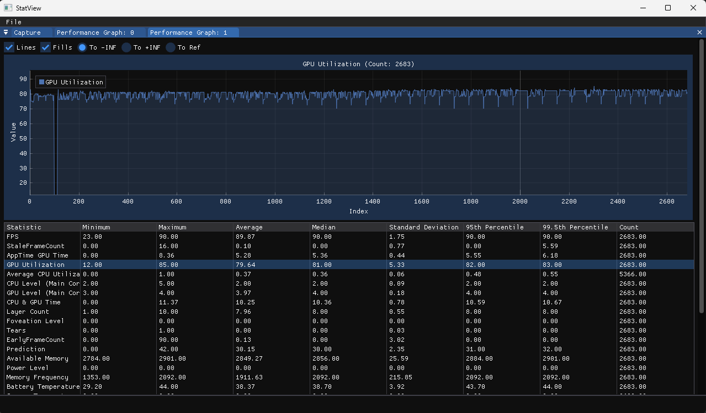
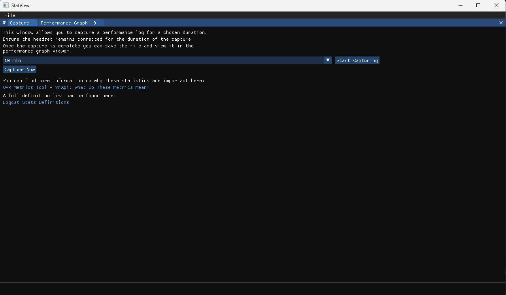

# StatView

## Overview
StatView transforms VrApi logcat data into easy-to-understand graphs, ideal for developers and QA personnel looking to enhance the performance of their VR applications. This tool simplifies the process of monitoring and visualizing crucial performance metrics from logcat files, providing a user-friendly interface to capture data over specified periods.

## Features
- **Simple Setup**: Easy to start with minimal configuration.
- **Performance Monitoring**: Select the duration you wish to monitor and simply hit "capture".
- **Graphical Visualization**: Automatically generates graphs from captured data, making performance trends and details immediately visible.

## Showcase




## Prerequisites
ADB Installation: Ensure that adb (Android Debug Bridge) is installed and available in your system path.

How to install ADB: [Medium Setup Article](https://theflutterist.medium.com/setting-up-adb-path-on-windows-android-tips-5b5cdaa9084b)

## Installation
1. Clone the repository:
```
git clone https://github.com/yourusername/StatView.git
```

## Usage
To use **StatView**:
1. Connect your VR device via USB and confirm it’s detected by running the command `adb devices`.
2. Determine the duration for which you want to capture performance data.
3. Execute the capture and wait for the tool to generate the performance graph.
4. Once the report has generated, you can open it by following `File > Open Latest Log File`
5. Alternatively, you can open previous logs with `File > Open Log File`. All captures are saved to the `Captures` folder under the application.

## License
StatView is released under the MIT License.